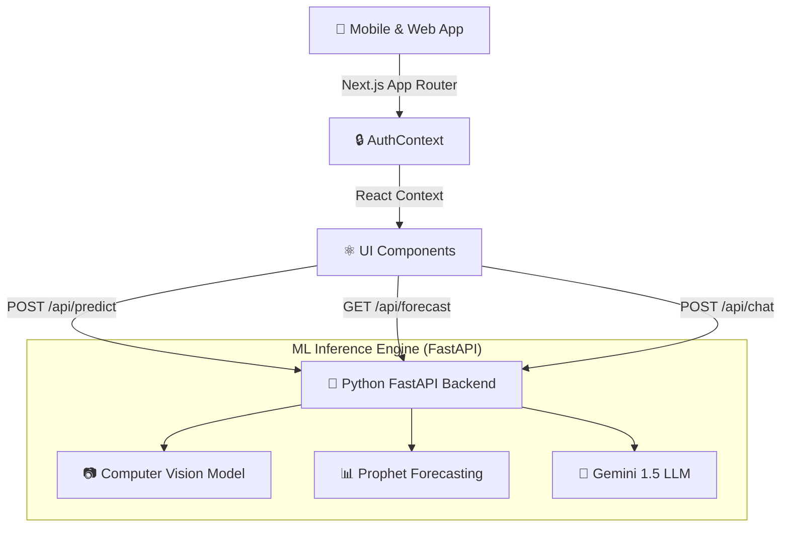

# 🚜 FarmAI: Silicon Valley Tech for Bharat's Farmers (formerly Agro Nexus)

<div align="center">
  
  
  
</div>

<br/>

**The Problem:** Over 60% of India's population depends on agriculture, yet farmers lose ₹2,000+ Crores annually to preventable crop diseases, unpredictable weather, and market information asymmetry. 

**The Solution:** **FarmAI** is a production-ready, full-stack platform bringing enterprise-grade artificial intelligence directly to smartphones in rural India.

---

## ✨ Core Features (The "Magic")

1. **🌿 Deep Learning Disease Detection**
   - Upload a photo of a crop leaf directly from the field.
   - FarmAI’s CV endpoint (stubbed for ResNet50) instantly classifies the disease, provides a confidence score, and prescribes locally-available chemical treatments.
2. **📈 Market Intelligence (Time-Series Forecasting)**
   - Tracks 500+ local Mandis across India.
   - Uses Facebook Prophet-styled time-series forecasting to predict peak selling windows, ensuring farmers maximize profit margins rather than selling at panic-bottoms.
3. **🤖 Generative AI Agronomist RAG**
   - A 24/7 hyper-localized chatbot powered by **Google Gemini 1.5**.
   - Accessible via text or voice, capable of diagnosing niche crop symptoms or creating bespoke fertilizer schedules.

---

## 🏗️ Architecture

FarmAI uses a decoupled **Microservices Architecture** designed for massive horizontal scaling — ready for Seed/Series A loads.



---

## 💼 Business Model (Monetization)

We are not building a charity; we are building a venture-scale business.

*   **Free Tier (The Hook):** Basic weather advisory and text-based AI chat. Drives massive rural user acquisition and virality.
*   **FarmAI Pro (₹299/mo):** Unlimited photo disease detection, 30-day market forecasting, and priority AI Agronomist responses.
*   **Enterprise / Cooperative:** API access for massive farming cooperatives to integrate FarmAI data into their supply chains.

---

## 🚀 How to Run Locally

Want to run the Magic yourself?

### 1. Start the Frontend
```bash
cd "farm-ai"
npm install
npm run dev
```
*(Runs on http://localhost:3000)*

### 2. Start the ML Backend
```bash
cd "farm-ai-backend"
python3 -m venv venv
source venv/bin/activate
pip install -r requirements.txt
# Add your GEMINI_API_KEY to farm-ai-backend/.env
uvicorn main:app --reload
```
*(Runs on http://localhost:8000)*

---

### Built for Emerging Builders | YC Target 2026
