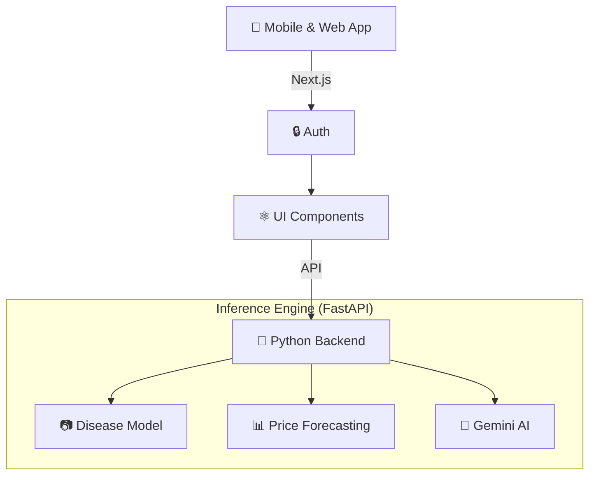

# Farm-AI

Farm-AI is a production-ready, full-stack platform that brings artificial intelligence directly to farmers. It helps diagnose crop diseases, forecast market prices, and provides AI-driven agricultural advice.

---

## ✨ Core Features

1. **🌿 Disease Detection**
   - Upload a photo of a crop leaf.
   - The system identifies the disease and suggests treatments.
2. **📈 Market Intelligence**
   - Tracks local market prices across India.
   - Uses forecasting to predict the best times to sell crops.
3. **🤖 AI Agronomist**
   - A 24/7 localized chatbot powered by Google Gemini.
   - Diagnoses symptoms and creates fertilizer schedules via text or voice.

---

## 🏗️ Architecture

Farm-AI uses a decoupled microservices architecture for scaling.



---

## 🚀 How to Run Locally

### 1. Frontend
```bash
cd "farm-ai"
npm install
npm run dev
```
*(Runs on http://localhost:3000)*

### 2. Backend
```bash
cd "farm-ai-backend"
python3 -m venv venv
source venv/bin/activate
pip install -r requirements.txt
# Add your GEMINI_API_KEY to farm-ai-backend/.env
uvicorn main:app --reload
```
*(Runs on http://localhost:8000)*

---

## 🚀 Deployment

The project is configured for easy hosting on **Vercel** (Frontend) and **Render** (Backend).

### Automated Deployment
You can use the provided script to sync your changes and trigger deployments:
```bash
./scripts/deploy.sh
```

### Manual Setup
1.  **Vercel (Frontend)**:
    -   Connect this repository to Vercel.
    -   The `vercel.json` will automatically configure the `farm-ai/` directory.
2.  **Render (Backend)**:
    -   Connect this repository to Render.
    -   Use the "Blueprint" feature and select the `render.yaml` file to set up the FastAPI service automatically.

---

## 📈 Scalability & Future Integration

Farm-AI is built with a "Plug-and-Play" architecture. While the current version uses high-fidelity mocks for fast demonstration, it is designed for seamless scaling to real-world data:

- **AI Advisor (NLP)**: Switch from mock to live advice by adding a `GEMINI_API_KEY` to the backend `.env`.
- **Disease Detection (CV)**: Swap the deterministic mock for a live CNN model (e.g., via the `transformers` library) in `main.py`.
- **Market Intelligence**: Integrate real-time Mandi prices by connecting the backend to the **Agmarknet API** (data.gov.in).
