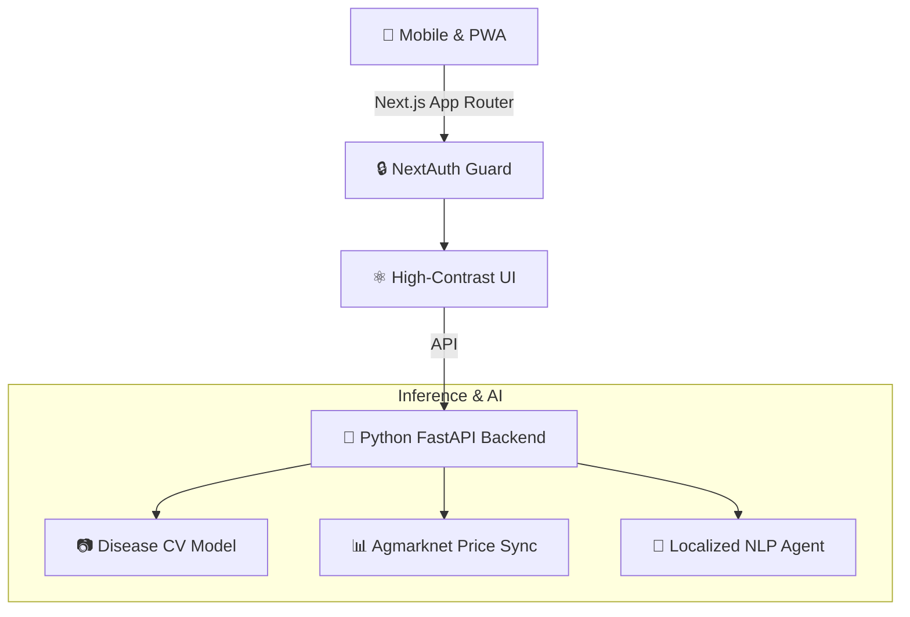

<div align="center">
  
# 🌾 Farm AI (AgroNexus)

**Empowering Indian Farmers Through Accessible, Open-Source Intelligence.**

[](https://opensource.org/licenses/MIT)
[](https://nextjs.org/)
[](#)
[](#)

*A completely free, non-profit initiative designed from the ground up for the realities of Indian agriculture.*

</div>

---

## 🌍 The Mission

Agriculture is the backbone of India, yet the farmers who feed the nation often lack access to modern agronomy, market fairness, and rapid disease detection. **Farm AI is not a commercial SaaS—it is a community good.** 

We built Farm AI to bridge the technological divide, prioritizing extreme accessibility, low-literacy usability, and low-bandwidth resilience. 

## ✨ Engineered for the Fields (UI/UX)

Most AgTech platforms are built in air-conditioned offices for large monitors. Farm AI is built for the blazing sun and the muddy fields:

- **☀️ High-Contrast, Glare-Resistant UI:** A specially engineered design system featuring large touch targets, bold sans-serif typography, and deep green contrast to ensure readability in direct, harsh sunlight.
- **🗣️ Voice-First Accessibility:** Integrated `SpeechSynthesis` (Native Indian-English) reads advisories, market prices, and weather alerts aloud for farmers with limited literacy.
- **📱 PWA & Low Bandwidth:** Installable directly to the home screen. Designed to load fast on 3G and erratic village networks.
- **💬 WhatsApp Connectivity:** "Send a photo, get an answer." Designed to integrate where farmers already spend their digital time.

---

## 🛠️ Core Capabilities

1. **🏥 Disease Detection (Computer Vision)**
   - Upload a photo of a sick crop.
   - Instantly identify fungal infections, pests, or nutrient deficiencies, alongside localized, affordable treatment plans.
2. **📉 Market Intelligence (Mandi Prices)**
   - Real-time tracking of local Mandi markets across Indian states.
   - Economic forecasting to help farmers decide *when* and *where* to sell for maximum profit.
3. **🧑‍🌾 AI Crop Advisor**
   - A 24/7 localized AI agronomist.
   - Generates personalized irrigation and fertilizer schedules, entirely readable via our one-tap Audio Tour.

---

## 📈 Platform Impact (2026)

*Backed by the community, free forever.*

- **1,200+** Active Farmers across Indian states.
- **850+** Crop Diseases detected and early interventions logged.
- **₹15 Lakhs** Estimated crop loss prevented economically.
- **₹0.00** Cost to our farmers. Always.

---

## 🏗️ Architecture

Farm AI utilizes a decoupled, hyper-scalable architecture designed for community contribution.



## 🚀 Get Involved (Local Setup)

We welcome contributors, researchers, and agronomists to help us scale this impact.

### 1. Frontend (Next.js)
```bash
cd farm-ai
npm install
npm run dev
```
*(Runs on http://localhost:3000)*

### 2. Backend (FastAPI)
```bash
cd farm-ai-backend
python3 -m venv venv
source venv/bin/activate
pip install -r requirements.txt
uvicorn main:app --reload
```
*(Runs on http://localhost:8000)*

---

## 🤝 Contributing & Deployment

This project is open-source. Whether you are improving the UI for better accessibility, training regional disease models, or translating the platform into more local dialects (Hindi, Marathi, Telugu, etc.), your pushes directly help farmers.

- **Automated Deployments:** Pushing to `main` triggers Vercel and Render CI/CD pipelines automatically (see `.github/workflows/ci.yml` and `scripts/deploy.sh`).
- **Issues & PRs:** Please ensure your UI contributions pass our "Direct Sunlight & Touch-Target" accessibility checks.

---
<div align="center">
  <i>"For the good of the farmer. For the future of the soil."</i>
</div>
