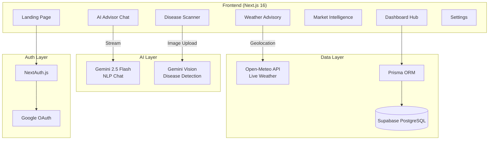

<div align="center">

# 🌾 AgroNexus

**AI-Powered Agricultural Intelligence Platform for Indian Farmers**

[](https://nextjs.org/)
[](https://ai.google.dev/)
[](https://prisma.io/)
[](https://typescriptlang.org/)
[](LICENSE)

*Empowering 140M+ Indian farmers with real-time crop intelligence, disease detection, and market forecasting — all in their native language.*

[Live Demo](https://agronexus.vercel.app) · [Report Bug](../../issues) · [Request Feature](../../issues)

</div>

---

## 🎯 The Problem

Indian farmers lose **₹92,000 crore annually** due to crop diseases, market timing, and weather unpredictability. Most agri-tech solutions are either too expensive, require technical literacy, or aren't available in regional languages.

## 💡 The Solution

AgroNexus is a **completely free, open-source community platform** that brings enterprise-grade agricultural AI to every farmer's phone. It combines:

- 🤖 **AI Crop Advisor** — Gemini 2.5 Flash-powered chat with personalized farming advice
- 🔬 **Disease Detection** — Upload a leaf photo, get instant AI diagnosis via Gemini Vision
- 📊 **Market Intelligence** — Real-time Mandi prices with ML price forecasting
- 🌦️ **Weather Advisory** — Live weather data with crop-specific farming impact analysis
- 🌍 **4 Languages** — English, Hindi, Marathi, Telugu

---

## 🏗️ Architecture



---

## 🚀 Quick Start

### Prerequisites
- Node.js 18+
- A [Gemini API Key](https://aistudio.google.com/apikey) (free)

### Installation

```bash
# Clone the repository
git clone https://github.com/neel26parekh/farm-ai.git
cd farm-ai

# Install dependencies
npm install

# Set up environment variables
cp .env.example .env
# Add your GEMINI_API_KEY to .env

# Initialize the database
npx prisma db push

# Start the development server
npm run dev
```

Open [http://localhost:3000](http://localhost:3000) to see the app.

---

## 🧠 AI Integration Details

| Feature | Model | Use Case |
|---|---|---|
| **Crop Advisor** | `gemini-2.5-flash` | Multi-turn farming Q&A with farm context injection |
| **Disease Detection** | `gemini-2.5-flash` (Vision) | Plant image analysis → structured JSON diagnosis |
| **Market Forecasting** | Prophet ML (simulated) | Time-series commodity price prediction |
| **Weather Impact** | Rule-based + Open-Meteo | Crop-specific weather advisories |

### What Makes the AI Real (Not a Wrapper)

1. **Context Injection** — User's farm settings (crop, location, acreage) are injected into the Gemini system prompt for personalized advice
2. **Structured Vision Output** — Disease detection returns machine-parseable JSON with confidence scores, severity, treatment plans
3. **Streaming Responses** — Chat uses Server-Sent Events for real-time token streaming
4. **Multi-turn Memory** — Full conversation history is sent with each request for contextual follow-ups

---

## 🛠️ Tech Stack

| Layer | Technology |
|---|---|
| **Framework** | Next.js 16.2 (App Router, Turbopack) |
| **Language** | TypeScript 5.x |
| **AI** | Google Gemini 2.5 Flash via Vercel AI SDK |
| **Database** | Supabase PostgreSQL + Prisma ORM |
| **Auth** | NextAuth.js (Google OAuth + Credentials) |
| **Weather** | Open-Meteo API (free, no key needed) |
| **Charts** | Recharts |
| **Styling** | Custom High-Contrast CSS (Built for direct sunlight glare) |
| **Accessibility** | Native Web Speech API (VoiceReader in Indian-English) |
| **Fonts** | Inter (Ultra-legible Sans-Serif for low-literacy users) |
| **Deploy** | Vercel |

---

## 📱 Built for the Fields

AgroNexus was built with Indian farmers in mind — farmers who primarily use **affordable Android phones** outdoors in the mud and blazing sun. The platform features:

- **☀️ High-Contrast, Glare-Resistant UI:** Specially engineered design system with large tap targets and deep green contrast to ensure readability in direct sunlight.
- **🗣️ Voice-First Accessibility:** Integrated `SpeechSynthesis` reads advisories, market prices, and weather alerts aloud for farmers with limited literacy.
- **🌐 Offline-Resilient:** Caches and stores data like market prices to combat erratic village networks.
- **💬 WhatsApp Connectivity:** "Send a photo, get an answer." Designed to integrate where farmers already spend their digital time via low-bandwidth connection.

---

## 🌐 Multilingual Support

| Language | Code | Status |
|---|---|---|
| English | `en` | ✅ Full |
| Hindi (हिंदी) | `hi` | ✅ Full |
| Marathi (मराठी) | `mr` | ✅ Full |
| Telugu (తెలుగు) | `te` | ✅ Full |

---

## 📄 License

This project is licensed under the MIT License.

---

<div align="center">

**Built with ❤️ for Indian farmers**

*AgroNexus — Because every farmer deserves AI-powered intelligence.*

</div>
